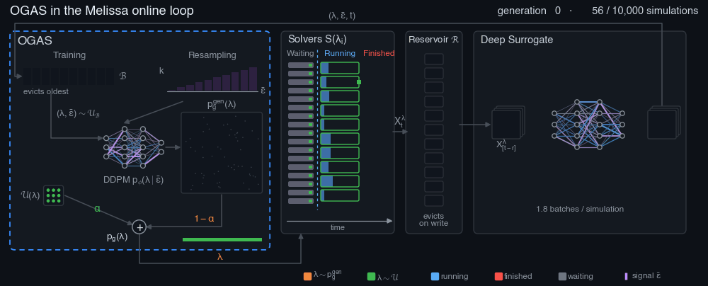

# Learning Where to Simulate

### Generative Active Sampling for Online PDE Surrogate Training (OGAS)

[](#citation)
[](https://arxiv.org/abs/2606.09949)
[](https://melissa-sa.github.io/ogas/)
[](LICENSE)
[](https://www.python.org/downloads/)

**Pierre Cesar, Sofya Dymchenko, Abhishek Purandare, Bruno Raffin**<br/>
Univ. Grenoble Alpes, Inria, CNRS, Grenoble INP, LIG (DataMove team) · **NeurIPS 2026**

[Paper](https://arxiv.org/abs/2606.09949) · [Project page](https://melissa-sa.github.io/ogas/) ·
[Melissa](https://gitlab.inria.fr/melissa/melissa) · [Citation](#citation)

<p align="center"></p>

To generalize across many initial conditions and physical coefficients, a neural PDE surrogate needs training
simulations that cover the resulting dynamics; drawn uniformly, these configuration parameters leave the hardest
regimes under-represented, and that is where the surrogate makes its largest errors. The **Online Generative Active
Sampler (OGAS)** fixes this imbalance while the surrogate trains: alongside it, a fast diffusion model learns to
generate configuration parameters conditioned on a training difficulty signal (loss or uncertainty), and OGAS sends
high-difficulty configurations to the next simulations. Unlike round-based active learning, sampling adapts
continuously, without pausing simulation or training.

On 3 PDEs × 3 architectures (189 runs of 10,000 simulations), at the same simulation budget as uniform sampling:

| Error ratio to Uniform (> 1: lower error) | RMSE-max | RMSE-p99 | RMSE-std | RMSE-mean |
|---|---|---|---|---|
| **OGAS-Loss** (training-loss signal) | 1.64 | 1.42 | 1.66 | 0.97 |
| **OGAS-Unc** (ensemble-disagreement signal) | 1.47 | 1.32 | 1.50 | 0.96 |

## Installation

You need Linux, [uv](https://docs.astral.sh/uv/getting-started/installation/), C/C++/Fortran compilers, CMake ≥ 3.24 and ≤ 3.35,
Open MPI and ([Melissa](https://gitlab.inria.fr/melissa/melissa), the online-training framework, is compiled
during the install), and an NVIDIA GPU with CUDA 12 or 13 for training. On Ubuntu:

```bash
sudo apt install build-essential gfortran cmake libopenmpi-dev openmpi-bin
```

> Melissa installs both ZeroMQ and Conduit during its installation phase.

Then:

```bash
git clone --recursive https://github.com/melissa-sa/ogas && cd ogas
uv venv && uv pip install --group build --no-binary mpi4py   # step 1: Melissa's build requirements, needed in the venv
uv sync                          # step 2: installs everything, including Melissa
source .venv/bin/activate
export APEBENCH_ROOT=$PWD        # the generated configs refer to it
python scripts/check_install.py   # post-install check: torch, jax and conduit.Node come from this venv
```

`uv sync` builds Melissa with `INSTALL_CONDUIT=ON` and `INSTALL_ZMQ=ON` (set in `pyproject.toml`). Because Melissa
installs Conduit into the active environment, it is built outside uv's isolated build environment, so step 1 installs
its build requirements into the venv first (uv needs them even to read Melissa's metadata). Melissa is rebuilt on every sync.

`torch` and `jax` use CUDA 12 wheels by default. For CUDA 13, run `uv sync --extra cuda13 --no-group cuda12`.
`frozen_requirements.txt` still holds the exact environment of the paper.

Already cloned without `--recursive`? Run `git submodule update --init`. Melissa is pinned to its
[`neurips26-ogas-release`](https://gitlab.inria.fr/melissa/melissa/-/tree/neurips26-ogas-release) tag.

**On Leonardo (CINECA)**, `source leo_melissa_init.sh install` loads the modules and builds the same environment;
afterwards, `source leo_melissa_init.sh` activates it. It runs the same `uv` steps as above;

## Quick start: one experiment

As an example: OGAS-Loss on Kuramoto-Sivashinsky with a UNet, seed 1. Every command runs from the repository root,
and everything is written under `experiments/` (`export EXP_DIR=/path/to/scratch` to put it elsewhere).

**1. Generate the configs** with Snakemake, keeping only this PDE, architecture, method group and seed:

```bash
cd snakemake_setup
snakemake --cores 4 --config 'active_scenarios=[kuramoto_sivashinsky_2d_low_res]' \
    'conditional_models=[unet_cond]' 'enabled_regime_groups=[ogas_breeder]' 'seeds=[1]'
cd ..
```

This writes the validation-set config `experiments/conditional_models_exp/val_data/config_offline_kuramoto_sivashinsky_2d_low_res.json`
and one training config per OGAS variant in `experiments/test_ensemble/kuramoto_sivashinsky_2d_low_res/unet_cond/`.
Everything else (number of simulations, model sizes, optimizer, ...) is set in
[`snakemake_setup/config.yaml`](snakemake_setup/config.yaml); the PDEs are listed in
[`pde_set.csv`](snakemake_setup/pde_set.csv).

**2. Make the run configs.** `make_study_config.py` turns a generated config into one that Melissa launches with
`mpirun` on the current machine (or Slurm allocation):

```bash
VAL=experiments/conditional_models_exp/val_data
python scripts/configs/make_study_config.py $VAL/config_offline_kuramoto_sivashinsky_2d_low_res.json \
    val_ks.json $VAL/kuramoto_sivashinsky_2d_low_res
python scripts/configs/make_study_config.py \
    experiments/test_ensemble/kuramoto_sivashinsky_2d_low_res/unet_cond/ddpm_conf_ratio_proportional_normalized/config_online_1.json \
    run_ks.json experiments/runs/ks_ogas_loss_s1 --seed 1
```

Training uses an ensemble of two surrogates, one GPU each; add `--n-models 1` on a single-GPU machine.

**3. Run** the validation set (750 simulations on CPU, once per PDE), then the training:

```bash
melissa-launcher --config val_ks.json
melissa-launcher --config run_ks.json
```

With Slurm (here Leonardo; set your account and partition in the `#SBATCH` lines of the scripts):

```bash
scripts/leo/job_global_offline_cpu.sh $VAL/config_offline_kuramoto_sivashinsky_2d_low_res.json
scripts/leo/job_study.sh run_ks.json ks_ogas_loss_s1 --time=07:00:00     # allocates one GPU per ensemble member
```

**4. Follow the training on Weights & Biases.** Runs are logged offline by default, inside the run directory. To see
them live:

```bash
wandb login
export WANDB_MODE=online            # before melissa-launcher
```

They appear in the project `apebench-kuramoto_sivashinsky_2d_low_res`, group
`TorchUNet_phy-ddpm_conf_ratio_proportional_normalized`. On clusters whose compute nodes have no internet (Leonardo),
keep the offline mode and upload afterwards:
`wandb sync $(find experiments/runs/ks_ogas_loss_s1 -type d -name 'offline-run-*')`.

A run directory holds the surrogate checkpoints (`checkpoints/model_*.pt`), the requested parameters
(`checkpoints/sampled_parameters.npy`) and the final diffusion model (`checkpoints/ddpm_final.pt`, written by
`job_study.sh`).

### Methods

To compare methods, use the matching training config (`enabled_regime_groups` selects them: `standard`, `ogas_breeder`,
`sbal`):

| Uniform | Sobol | Breed | SBAL / Top-K | **OGAS-Loss** | **OGAS-Unc** |
|---|---|---|---|---|---|
| `no_resampling` | `no_resampling_sobol` | `mixed_nrmse` | `sbal` / `sbal_topk` | `ddpm_conf_ratio_proportional_normalized` | `ddpm_conf_ratio_proportional_uncertainty` |

## Reproducing the paper (Slurm)

The full study is 3 PDEs × 3 architectures × 7 methods × 3 seeds. On Leonardo:

```bash
cd snakemake_setup && snakemake --cores all && cd ..        # all configs
scripts/leo/job_global_offline_cpu.sh                       # validation sets, one CPU job per PDE
scripts/leo/submit_benchmark.sh ddpm_conf_ratio_proportional_normalized   # one method: all PDEs, architectures, seeds
scripts/leo/submit_ablations.sh                             # ensemble size and CRPS signal (Kuramoto-Sivashinsky)
scripts/leo/job_eval_fast_chain.sh                          # evaluate every checkpoint -> experiments/eval/metrics_long.csv
```

`submit_benchmark.sh` takes a method name from the table above. The paper tables and figures are built from
`metrics_long.csv` by [`scripts/analysis/paper/`](scripts/analysis/paper/README.md).

## Repository structure

```
apebench_online/   solver client (core/solver.py), training servers, models, parameter samplers, PDE scenarios
melissa/           Melissa (submodule): launcher, server, and the OGAS sampler (server/deep_learning/active_sampling)
scripts/configs/   config generation (generate_config_cli.py is called by Snakemake; make_study_config.py)
scripts/leo/       Slurm job scripts for Leonardo
scripts/analysis/  evaluation and paper figures
snakemake_setup/   experiment definition (config.yaml, pde_set.csv)
docs/              project page; docs/tools renders its figures
```

## Citation

```bibtex
@inproceedings{cesar2026learning,
  title     = {Learning Where to Simulate: Generative Active Sampling for Online {PDE} Surrogate Training},
  author    = {Cesar, Pierre and Dymchenko, Sofya and Purandare, Abhishek and Raffin, Bruno},
  booktitle = {Advances in Neural Information Processing Systems (NeurIPS)},
  year      = {2026}
}
```

## License

MIT, see [LICENSE](LICENSE). Melissa is distributed under its own BSD 3-Clause license; adapted third-party model
code (AL4PDE, PDEArena, scOT) is in [`apebench_online/vendor/`](apebench_online/vendor) with its license. The PDE
solvers come from [APEBench](https://github.com/tum-pbs/apebench) and [Exponax](https://github.com/Ceyron/exponax).

## Acknowledgements

This work was supported by the Exa-DoST project of the NumPEx PEPR program (France 2030, ANR-22-EXNU-0004) and by
the European Union's Horizon programme under grant agreement No 101144014 (EoCoE-III). It used HPC resources of
IDRIS (GENCI allocation AD010610366R4) and the EuroHPC supercomputer LEONARDO hosted by CINECA, and the Grid'5000
and GRICAD infrastructures for early testing.
